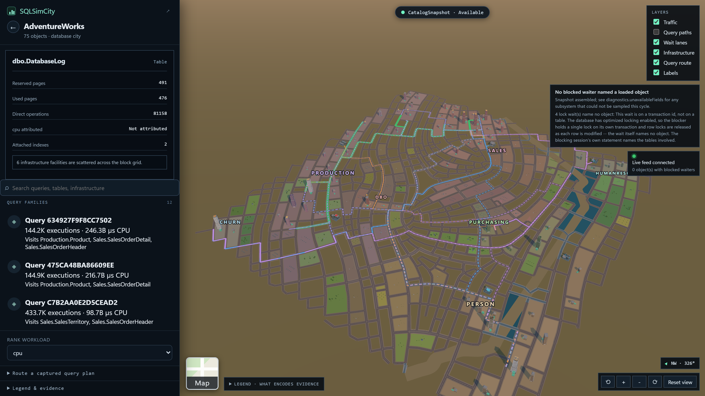
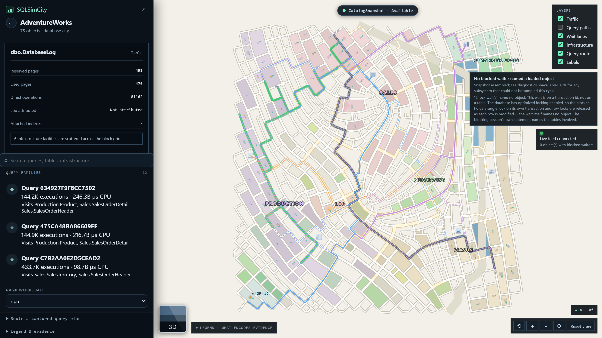
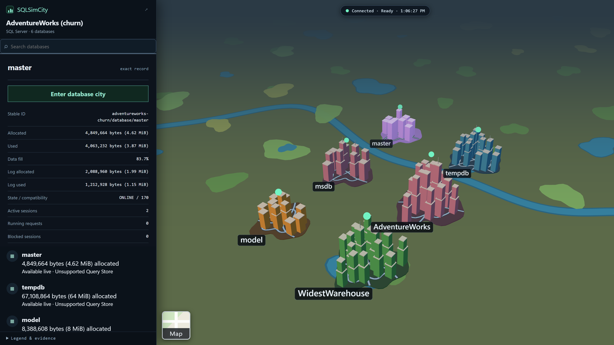

# SQLSimCity

**Turn a SQL Server into a city you can walk through.** SQLSimCity is a self-hosted, read-only
performance tool that draws your instance as an atlas of databases and each database as a city —
tables are buildings sized by real page counts, query traffic is roads, and waits are lanes leading
to civic facilities like the Lock Authority and Memory Grant Office.

Every shape maps to a measurement you can verify. Nothing is invented, and unavailable evidence is
drawn as a wireframe rather than a guess.

**[Try the live demo →](https://sqlsimcity.battagler.me/)** · Heavily inspired by
[PGSimCity](https://github.com/NikolayS/PGSimCity).



## What it does

- **Server atlas** — every database on the instance as its own city, plot sized by allocated storage
  and tallest tower by used storage.
- **Database city** — tables and indexes as buildings, query families as roads, Query Store waits as
  lanes into tempdb, log, lock, memory-grant, CPU, and I/O facilities.
- **Two views of the same city** — a flat top-down map for reading structure and traffic, and a 3D
  city for reading massing. One toggle, one object graph, the same evidence.
- **The Query Store address book** — one searchable sidebar listing query families, tables, and
  infrastructure together, each with its measured metric and its block address on the map.
- **Incident pins** — live blocking and wait-graph cycles pinned to the building they were measured
  on, with the source DMV and observation time in the popup.
- **Offline archives** and an optional **outward-only edge connector** for servers you can't reach directly.

Building placement is deterministic: every lot is derived from a seeded generator keyed on the
database's own id, so the same database lays out identically on every load and every machine, and
loading another page of objects never moves a building that is already on screen.

SQLSimCity is strictly read-only against monitored servers. Query Store history is aggregate
evidence, live DMVs are point-in-time samples, and inferred relationships are always labelled with
their confidence. A subsystem that could not be sampled is drawn as unavailable, never as clear.

> [!WARNING]
> **SQLSimCity has no built-in login.** Anyone who can reach the page sees all evidence. Keep it on
> loopback or a trusted network, or put it behind an authenticating reverse proxy. See
> [SECURITY.md](SECURITY.md).

## Quick start

Fixture mode needs no SQL Server and is the fastest way to look around.

```powershell
docker compose up --build
```

Open <http://127.0.0.1:8080>.

### Point it at a real server

One connection string is enough to turn connected mode on:

```powershell
docker build -t sqlsimcity:local .

docker run --rm --name sqlsimcity `
  --publish 127.0.0.1:8080:8080 `
  --env ConnectionStrings__SqlSimCity="Server=sql01.example.internal,1433;Database=master;User Id=sqlsimcity_reader;Password=<password>;TrustServerCertificate=true" `
  sqlsimcity:local
```

The password is parsed into a `SqlCredential` and never lands in a log or diagnostic, but an
environment variable is still readable by anything that can read the process environment. For
production, set the connection fields individually and mount the password as a read-only file
secret — see [connected mode](docs/connected-mode.md) for the hardened setup, least-privilege
permissions, Azure SQL, Query Store, and live sampling.

## Screenshots

| Flat map view | Server atlas |
| --- | --- |
|  |  |

Both surfaces are the same map shell: a full-screen map, a searchable sidebar, and one toggle
between the flat map and the 3D city. The tile at the bottom-left of the map switches between them.

## Documentation

| Guide | Contents |
| --- | --- |
| [Architecture and evidence](docs/architecture.md) | Components, evidence boundaries, visual semantics, scale, and API surfaces |
| [Connected mode](docs/connected-mode.md) | SQL connection profiles, permissions, Query Store, live incidents, TLS, and secrets |
| [Operations](docs/operations.md) | Reverse proxy and `AllowedHosts`, backup/restore, upgrades, rollback, SBOM, and provenance |
| [Security](SECURITY.md) | Threat model, key rotation, Kerberos, Microsoft Entra ID, and fail-closed behavior |
| [Offline archives](docs/archive-format.md) | Redacted export format and offline import |
| [Edge connector](docs/edge-connector.md) | Outward-only remote collection, signing, replay defense, and encrypted spool |
| [SQL probe catalog](sql/README.md) | Read-only probe contracts, permissions, platform scope, and units |
| [Fixture contract](fixtures/v1/README.md) | Sanitized deterministic evidence used by tests and demos |

## Development

Requires .NET SDK 10 and Node.js 24 (Node 22.12+ also works). Vite serves the UI and proxies
API/SignalR traffic to port 5080.

```powershell
# Terminal 1
dotnet run --project src\SqlSimCity.Api --urls http://127.0.0.1:5080

# Terminal 2
Set-Location web
npm install
npm run dev
```

Full validation:

```powershell
npm test
node --test fixtures\v1\test\validate-fixtures.test.mjs
dotnet test SqlSimCity.slnx

Set-Location web
npm test; npm run typecheck; npm run build
```

See [CHANGELOG.md](CHANGELOG.md) for shipped changes and known validation gaps.

## Affiliation

SQLSimCity is independent software. It is not affiliated with, sponsored by, or endorsed by
Microsoft, Electronic Arts, Maxis, the SimCity franchise, or the PostgreSQL project. No SimCity
assets are included.

## License

Copyright 2026 SQLSimCity contributors. Licensed under Apache-2.0; see [LICENSE](LICENSE) and
[NOTICE](NOTICE).
